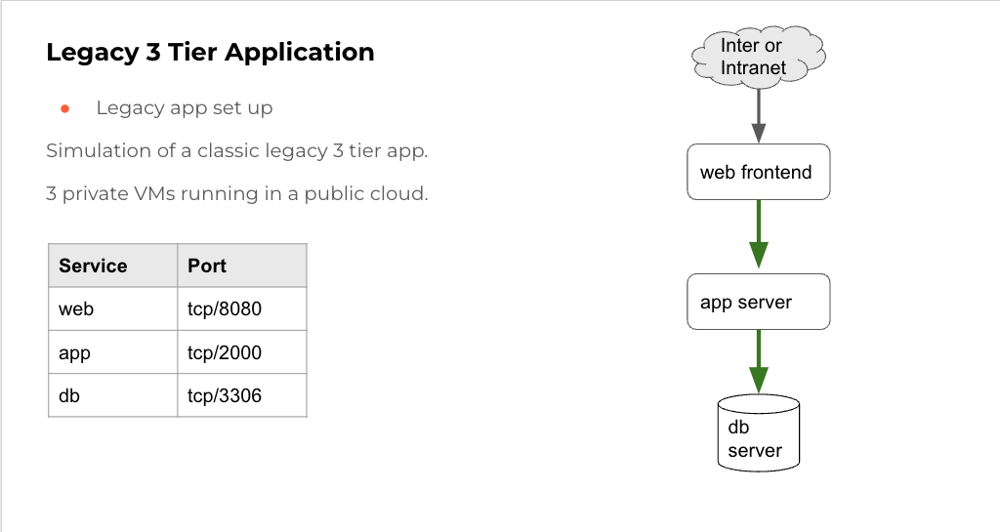
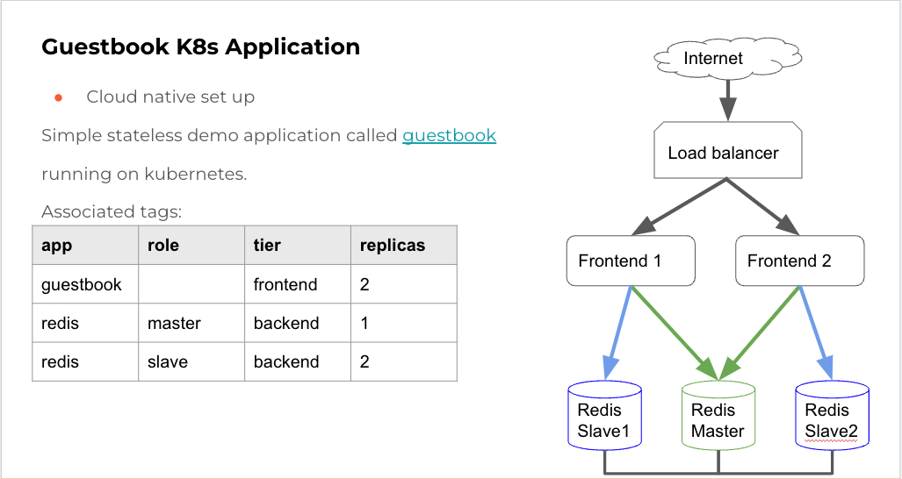

# Microsegmentation Lab Sample Applications

This repo contains sample applications that can be used to demonstrate how microsegmentation works.

## Legacy App

The contents of this directory contain scripts that simulate the workings of a very simple 3 tier application, with each tier running on a separate VM. 

## Guestbook

This is a kubernetes manifest that can be used to deploy a very simple [guestbook application](https://kubernetes.io/docs/tutorials/stateless-application/guestbook/). There is also a simple shell script that can generate traffic to the exposed front end load balancer / node port.

